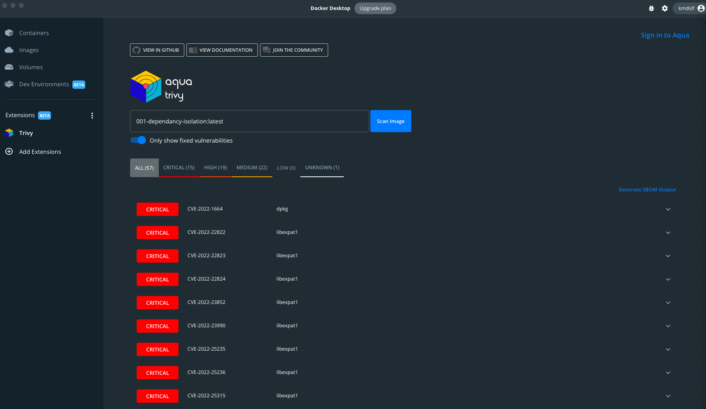
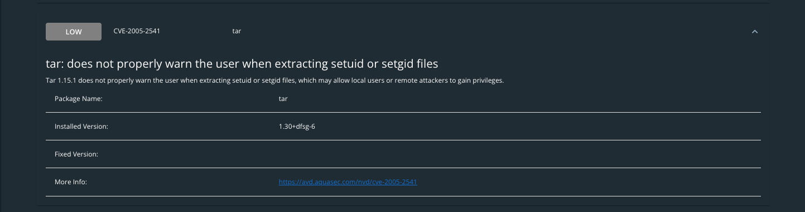
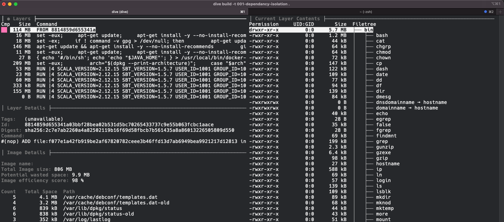
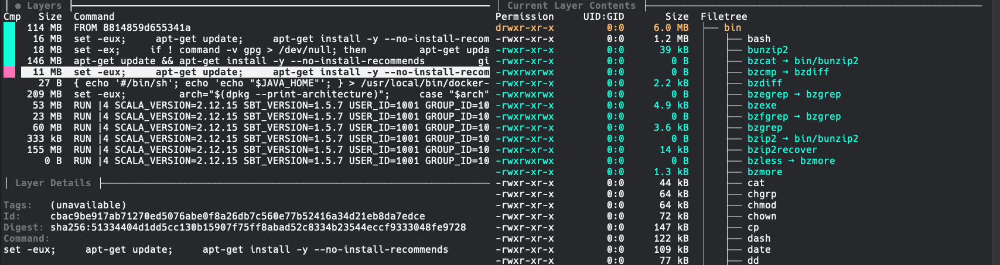
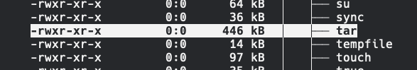
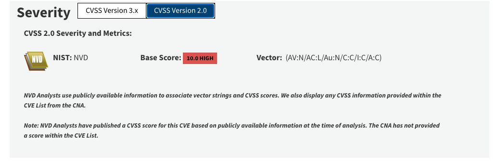
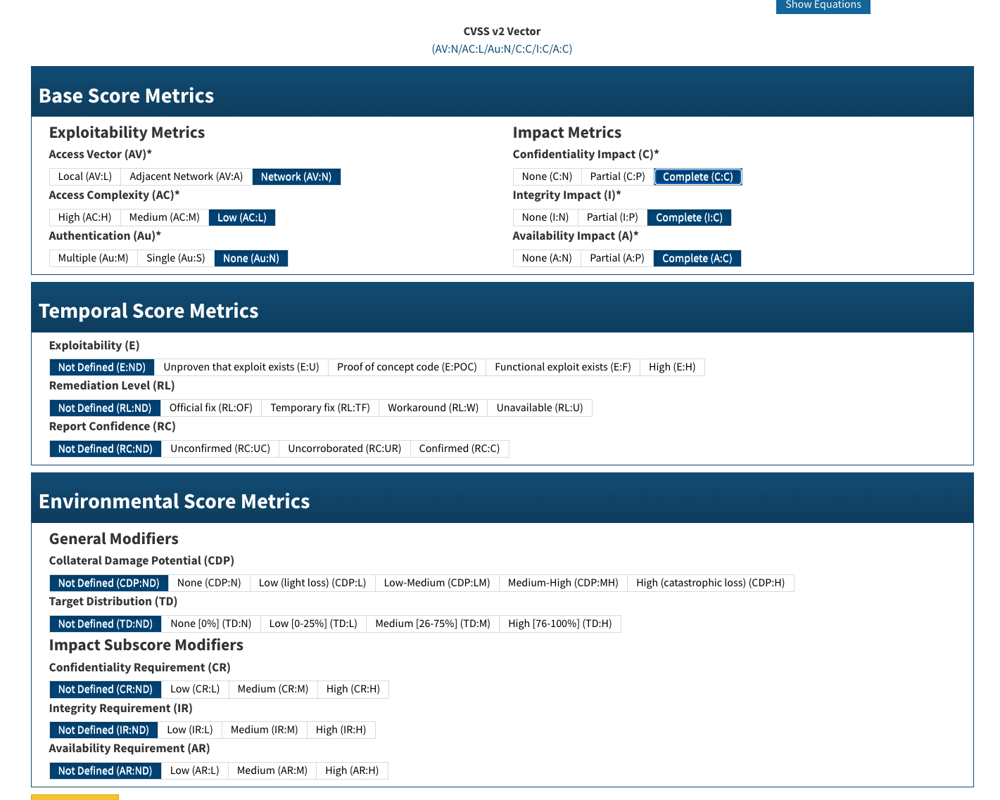

# 001 Dependency Isolation and Discovery in Docker Containers

## Scenario

The security team has informed you of a vulnerability in your applications container and you have to find and resolve it.

## Tools

- [Dive by Wagoodman][TOOLS1]: Dive into the layers of your container.
- [Trivy by Aqua Security][TOOLS2]: Comprehensive Scanner for OCI Container Images.

## Solution

There are a multitude of ways to find and resolve dependency issues within any tech stack. Most languages have tools for dependency management but when leveraging tooling such as Docker we quickly find that the abstractions it provides can also make it difficult to isolate the true source of the problem.

### Vulnerability Scanning with Trivy

Trivy by Aqua Security is an OpenSource tool that allows you to scan local containers for vulnerabilities. There are two easy ways to use Trivy, either by the CLI or within Docker Desktops Extensions Feature.

While in Docker Desktop, with the Trivy extension installed and the image built, you can initiate a local scan and fetch the results.



Once the scan is complete you can investigate the findings further, you will notice that by default the results will only contain findings that have an existing fix. If you disable this via the toggle you can re-scan to gather a complete list of findings regardless of if a fix is available or not.

Drilling into a finding you will be presented with the following information:



### Layer Inspection with Dive

Inspecting the layers of a docker container can help find and isolate problem areas such as image efficiency and layer contents. While this

```bash
dive build -t 001-dependancy-isolation .
```

You will be presented with the following interface:



From this interface you can explore individual layers of your container and their respective contents.

While exploring individual layers we can see what contents are added and how:



Using our example above of `tar CVE-2005-2541` we can see that on the initial layer `tar` is already present and is not modified in any way during our build process.



We can exec into the container with the following command:

```bash
docker run --rm -it --entrypoint bash 001-dependancy-isolation
```

We can then confirm that the current version of Tar is effected by the CVE Trivy has found:

```bash
root@7e0c1f656e06:~# tar --version
tar (GNU tar) 1.30
Copyright (C) 2017 Free Software Foundation, Inc.
License GPLv3+: GNU GPL version 3 or later <https://gnu.org/licenses/gpl.html>.
This is free software: you are free to change and redistribute it.
There is NO WARRANTY, to the extent permitted by law.

Written by John Gilmore and Jay Fenlason.
```

We can also double check the current Base Operating System of the container:

```bash
root@7e0c1f656e06:~# cat /etc/os-release
PRETTY_NAME="Debian GNU/Linux 10 (buster)"
NAME="Debian GNU/Linux"
VERSION_ID="10"
VERSION="10 (buster)"
VERSION_CODENAME=buster
ID=debian
HOME_URL="https://www.debian.org/"
SUPPORT_URL="https://www.debian.org/support"
BUG_REPORT_URL="https://bugs.debian.org/"
```

Since we know that we are on Debian 10(Buster) using tar 1.30(+dfsg-6) we can confirm that Debian does not support a higher version of the package by checking the [Upstream Package Repository.][REPO1]

This leaves us with a few options, since Debian is not providing a more up to date version of Tar we can either build our own binary for it or remove it all together from the container. It is a best practice to only include what is absolutely needed in your final container but in some cases, such as php based applications, you may find cases where tools such as `tar` are actually required by a dependency your application has.

We have one other option that should be used with great caution, that is accepting the risk.

### Understanding and Accepting the Risk

Every vulnerability should be treated with the same diligence but they are not the same. To help us understand them we lean on the [National Institute of Standards and Technology][NIST] and the [National Vulnerability Database][NVD].

Every entry into the database is formatted the same and there are some key areas to look at to understand the true scope of a vulnerability.

1. Current Description: A simple explanation of what the problem is.
1. Severity: The results of the Common Vulnerability Scoring System Calculator.

With our example from above, [CVE-2005-2541][CVE-2005-2541], we can see that the Current Description is the following:

- `Tar 1.15.1 does not properly warn the user when extracting setuid or setgid files, which may allow local users or remote attackers to gain privileges.`

While at first glance there is no Severity it is because this CVE is quite old, NIST will display the CVSS Version 3.x by default so you will have to expand the CVSS Version 2.0 results to find the following:



We can see the most important bit of information here, the Base Score, is a `10.0` or a `HIGH`. This means the vulnerability is pretty bad but fails to explain why it is bad. To understand that we have to see how this CVE achieved this score by drilling into the Vector information. Clicking on the base score will bring up the [Calculator for this CVE][CVE-2005-2541-CALC].



The calculator will explain all of the Metrics used for scoring a CVE with a simple explanation of what they mean. It will not give examples however, it is meant as a universal way to explain any discovered vulnerability and uniformly rate them.

For our example we can see that this CVE scores a low on `Access Complexity` for example. This simply means that the level of access required to exploit the vulnerability is not at all complex. Anyone with access to the command line could potentially leverage this as a means to attach your application. At the same time it scores a None on `Authentication`, since tar is a system wide tool even unauthorized users could potentially use it!

Finally there is the `Access Vector`, this is one of the more important metrics to consider when handling vulnerabilities. It is simply, what does an attacker need to do to have a chance at exploiting this? In this case it is a `Network` vector which is the nice way of saying `Remotely Exploitable` and that an attacker DOES NOT require Local Access.

All of this sounds really bad! We have a vulnerability that is super easy to exploit!

Before we panic, what does this all REALLY mean?

`If running as the root user tar restores the original permissions to extracted files, this includes the setuid bit.` That sounds normal to me, in fact...the vendor has provided the following statement:

`This is the documented and expected behavior of tar.` - Red Hat

So it's not scary then? Yes and no and we have to use our best judgment. While this is the default behavior of tar we have to ask ourselves a few questions.

1. `Do I need tar?` If you know your application does not need it you should remove it, the less you leave in your container the less chance for a bad day.
1. `How available is the attack vector in my environment?` Does the service have a public endpoint? Is that endpoint protected? Does it require authentication? Is this an internal
1. `Is there an easy enough fix?` There is no fixed version of tar and since this is normal behavior there never will be so simply updating the package isn't an option. We could remove it but that could negatively impact the applications functionality. If we try to remove it and it works just fine than we have achieved a solid solution but what if we cannot remove it?
1. `Is it really that bad?` You have to run this as root for this exploit to work as intended. While my container as a root user it is a best practice to not run it as root in production. If I am creating a non-root user and ensuring that my application runs as a non-root user then how can attacker exploit this?

## Synopsis

[CVE-2005-2541]: <https://nvd.nist.gov/vuln/detail/CVE-2005-2541>
[CVE-2005-2541-CALC]:<https://nvd.nist.gov/vuln-metrics/cvss/v2-calculator?name=CVE-2005-2541&vector=(AV:N/AC:L/Au:N/C:C/I:C/A:C)&version=2.0&source=NIST>
[NIST]: <https://www.nist.gov/>
[NVD]: <https://nvd.nist.gov/>
[REPO1]: <https://packages.debian.org/buster/tar>
[TOOLS1]:<https://github.com/wagoodman/dive>
[TOOLS2]: <https://aquasecurity.github.io/trivy/>
